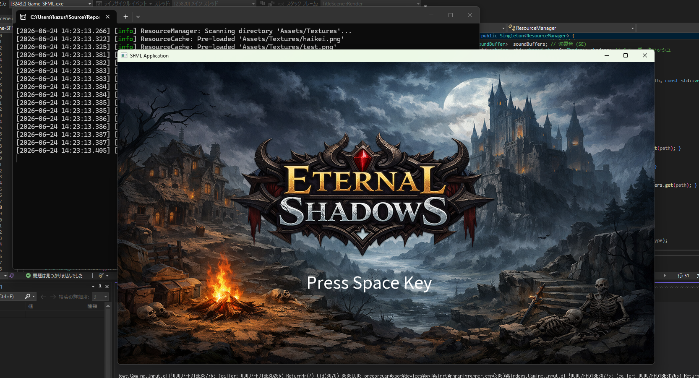
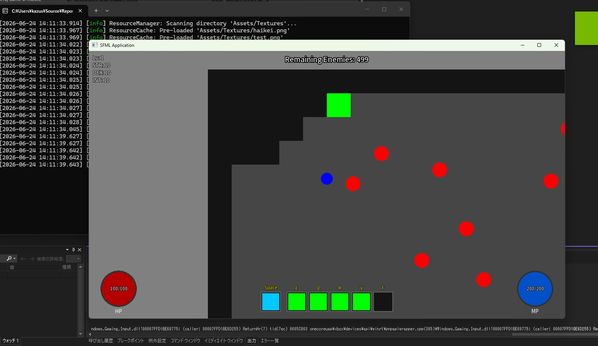
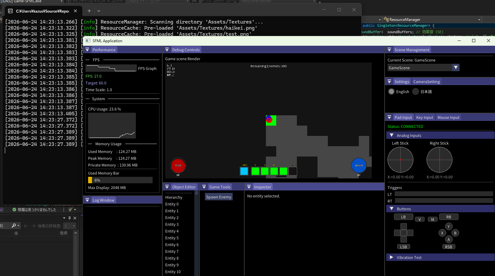

# 作品名
POEモドキ
## 概要

この作品は、２年の後期に授業課題として制作しました。
ゲームジャンルは特に指定がなかったためはまっていたPath of Exile 2のようなハクスラを
作りたいと考え制作をしました。

ただ、この時期にUnityでのチーム制作がありそちらを優先しないといけないため
ECSなどシステム面をできるだけ触ってみようと考え制作しました。

---

## 制作時期

* 制作年度：2025年度
* 学期：後期
* 制作期間：2025年10月 ～ 2025年1月

---

## 開発環境

| 項目  | 内容                 |
| --- | ------------------ |
| OS  | Windows 11         |
| 言語  | C++                |
| IDE | Visual Studio 2022 |
---

## 使用ライブラリ・技術

* SFML
* ImGui
* Git / GitHub

---

## 操作方法

| キー            | 動作    |
| ------------- | ----- |
| W / A / S / D | 移動    |
| E / Q / R / V | スキル  |
| Space | 回避 |
| F1 | デバッグ |

---

## 工夫した点・頑張った点

* ECSの自作
* ImGuiでのデバッグ画面制作

---

## 苦労した点

* ECSの構造を理解し、自分で作ること
何度も作っては壊しを繰り返しやっとできました
* デバッグ画面
シーンの切り替えにもしっかり対応するようにどう対応させるか

---

## 今後の改善点

* システムだけではなくゲーム内もしっかりとした内容を作る

---

## スクリーンショット

### タイトル画面

### ゲーム画面

### デバッグ画面

